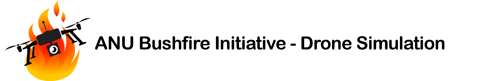

|ANU Bushfire Initiative Drone Logo|

This is a python application that allows the simulation of drones for
fast lightning strike investigation and potential suppression by a fleet
of water bombers.

|pre-commit| |test|

.. include:: install_directions.rst

.. |pre-commit| image:: https://github.com/ryanstocks00/anu-bushfire-initiative-simulation/actions/workflows/python-3.8-pre-commit.yml/badge.svg
   :target: https://github.com/ryanstocks00/anu-bushfire-initiative-simulation/actions/workflows/python-3.8-pre-commit.yml
.. |test| image:: https://github.com/ryanstocks00/anu-bushfire-initiative-simulation/actions/workflows/python-3.8-test.yml/badge.svg
   :target: https://github.com/ryanstocks00/anu-bushfire-initiative-simulation/actions/workflows/python-3.8-test.yml
